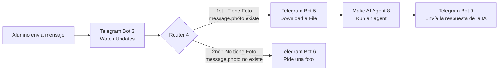

# Nombre del proyecto

**Escenario "Ecosistema": identificación de organismos con Make.com, Telegram e Inteligencia Artificial**

- **Alumno:** Cesar Jesus Gamez Mendoza
- **Materia:** Desarrollo Sustentable
- **Profesor:** Mtro. Miguel Ángel Barrón Hernández
- **Institución:** Instituto Tecnológico de Mazatlán

## Descripción

Automatización hecha en Make.com para identificar organismos del jardín del Tecnológico. El alumno toma una foto de un organismo (planta, insecto, hongo, etc.) con su teléfono y la manda a un bot de Telegram. Make recibe el mensaje, descarga la imagen y se la pasa a un Agente de IA. El agente responde en segundos con:

- el nombre probable del organismo,
- su nivel trófico (**productor**, **consumidor** o **descomponedor**),
- su función en el ecosistema.

Si el alumno manda solo texto, el bot le pide que envíe una foto.

## Objetivos de aprendizaje

**Objetivo general:** diseñar y documentar una automatización en Make.com que, con un bot de Telegram y un Agente de IA con visión, identifique organismos del ecosistema del plantel a partir de una fotografía y clasifique su rol trófico.

**Objetivos específicos:**

- Configurar un disparador (trigger) de Telegram que reciba en tiempo real los mensajes enviados al bot.
- Enrutar el flujo según el contenido recibido (con foto o solo texto) con un módulo Router y dos filtros.
- Descargar la imagen de Telegram y dársela como entrada al Make AI Agent.
- Redactar un *system prompt* que limite la respuesta a un formato breve, estructurado y en español.
- Responder automáticamente al alumno con el resultado del análisis.
- Reforzar los conceptos de productor, consumidor y descomponedor dentro de un ecosistema.

## Material utilizado

Esta práctica no usa Arduino ni componentes electrónicos. Se utilizó:

- Laptop (para construir el escenario en Make.com)
- Teléfono celular con Telegram (para tomar y enviar las fotos)
- Cuenta de **Make.com** (zona us2.make.com) con el módulo **Make AI Agent**
- Bot de **Telegram** creado con @BotFather
- Modelo de IA: *Medium* de Make (gpt-5-nano, razonamiento bajo)

## Diagrama del circuito

En lugar de un circuito, se documenta el **escenario de Make** (6 módulos y un Router con 2 rutas).




| # | Módulo | Función |
|---|--------|---------|
| 3 | Telegram Bot — Watch Updates | Disparador: se activa cada vez que llega un mensaje al bot (webhook). |
| 4 | Router | Divide el flujo en dos rutas según si el mensaje trae foto. |
| 6 | Telegram Bot — Send a Text Message | Ruta sin foto: pide al alumno que envíe una foto. |
| 5 | Telegram Bot — Download a File | Ruta con foto: descarga la imagen de mayor resolución. |
| 8 | Make AI Agent — Run an agent | Analiza la imagen con el *system prompt* y genera la respuesta. |
| 9 | Telegram Bot — Send a Text Message | Envía la respuesta de la IA al mismo chat. |

**Filtros del Router:**

- **Tiene Foto** (entre el Router 4 y el módulo 5): `{{3.message.photo}}` — *exist*
- **No tiene Foto** (entre el Router 4 y el módulo 6): `{{3.message.photo}}` — *not exist*

## Código

El "código" de esta práctica es el escenario de Make exportado como blueprint:

- [`Codigo/Ecosistema.blueprint.json`](Codigo/Ecosistema.blueprint.json): se puede importar en Make con **Import Blueprint**.
- [`Codigo/system_prompt.txt`](Codigo/system_prompt.txt): instrucciones del Agente de IA.

```text
Eres un asistente educativo que identifica organismos en fotos tomadas
por estudiantes en el jardín del Tecnológico, para la materia de
Desarrollo Sustentable, tema "El Ecosistema".

Cuando recibas una imagen, responde SIEMPRE en este formato, sin texto
adicional antes o después:

🔎 [nombre probable del organismo]
🌱 [Productor / Consumidor / Descomponedor]
♻️ [rol en el ecosistema en máximo 15 palabras]

Si la imagen no muestra un organismo vivo, responde únicamente:
"❌ No identifico un organismo. Intenta con una planta, insecto u otro
ser vivo."

Reglas estrictas:
- Máximo 35 palabras en total.
- Sin introducciones, sin despedidas, sin explicaciones extra.
- Responde siempre en español.
```

## Video del funcionamiento

[Ver video en YouTube](https://youtube.com/shorts/PawcdZoOtOs)

## Evidencias de armado

- Captura del escenario armado en Make: [`Diagrama/Escenario Ecosistema.png`](Diagrama/Escenario%20Ecosistema.png)
- Prueba en el jardín del Tecnológico, grabada en el [video](https://youtube.com/shorts/PawcdZoOtOs).
- Salida del bot: [`Terminal/Salida del bot.txt`](Terminal/Salida%20del%20bot.txt)


| Foto | Respuesta del bot |
|------|-------------------|
| Foto 1 del arbusto (12:00) | 🔎 *Lantana camara* · 🌱 Productor · ♻️ Fuente de néctar para polinizadores; planta ornamental y cobertura |
| Foto 2 del mismo arbusto (12:01) | 🔎 *Tagetes erecta* · 🌱 Productor · ♻️ Proporciona alimento y refugio a insectos; ayuda a polinización y mejora suelo. |

## Reporte

Incluye: [`Reporte/Reporte de la práctica.pdf`](Reporte/Reporte%20de%20la%20pr%C3%A1ctica.pdf)

**Observaciones sobre el comportamiento del sistema:**

- El escenario es instantáneo: Telegram avisa a Make por webhook en cuanto llega el mensaje, y la respuesta tarda solo unos segundos.
- El Router usa el campo `message.photo` para decidir la ruta. Así el Agente de IA solo se ejecuta cuando hay imagen, lo que ahorra operaciones de Make.
- El *system prompt* hace que la respuesta sea corta (máximo 35 palabras) y siempre con el mismo formato, ideal para leerse en el chat.
- La clasificación trófica fue correcta (**productor**) en las dos pruebas, pero el bot dio **dos nombres de especie distintos** para el mismo arbusto (*Lantana camara* y *Tagetes erecta*). El modelo gpt-5-nano es rápido y barato, pero menos preciso para distinguir especies parecidas; el nombre debe tomarse como sugerencia y confirmarse con otra fuente.

## Conclusiones

La práctica permitió aplicar la automatización a un tema de Desarrollo Sustentable. Con un bot de Telegram, un Router con filtros y un Agente de IA en Make.com se construyó una herramienta que identifica organismos del jardín del Tecnológico y los clasifica según su nivel trófico. En las pruebas, el bot clasificó correctamente la planta fotografiada como **productor** y explicó su función para los polinizadores.

También se observó una limitación: el mismo arbusto recibió dos nombres de especie diferentes en dos fotos seguidas, lo que enseña que la respuesta de una IA debe verificarse con otras fuentes. Además, se reforzó la importancia de los filtros del Router: sin ellos, el Agente de IA se ejecutaría aunque el mensaje no trajera imagen. También, un buen *system prompt* es clave para que la IA dé respuestas breves y en español. Este tipo de herramienta acerca a los estudiantes al reconocimiento práctico de los organismos que forman un ecosistema.

## Resultados

[`Resultados/Resultados.pdf`](Resultados/Resultados.pdf)

Este documento contiene los casos de prueba, las respuestas del bot y el análisis de los resultados.

- Reporte técnico: [`Reporte/Reporte de la práctica.pdf`](Reporte/Reporte%20de%20la%20pr%C3%A1ctica.pdf)
- Blueprint del escenario: [`Codigo/Ecosistema.blueprint.json`](Codigo/Ecosistema.blueprint.json)
- Diagramas: [`Diagrama/`](Diagrama/)
